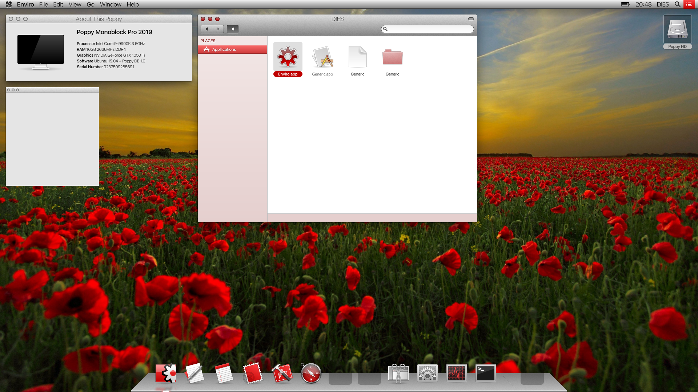

**RU** | [EN](README_EN.md)

Poppy
--
Свободная реализация OS X-подобного пользовательского опыта.

#### Концепт

#### Скриншот

### Терминология

- Poppy &mdash; это свободный проект, развивающий сразу несколько направлений, в совокупности предоставляющих целостный пользовательский опыт, схожий с использованием Mac OS X (в частности, версии 10.9 Mavericks), но не включающий его самые худшие стороны, такие как привязка к конкретному оборудованию или плата за программное обеспечение. В отличие от проектов вроде pearOS, ravynOS и helloSystem - которые фокусируются преимущественно на поверхностной имитации интерфейса macOS, или GnuStep - наоборот, предлагающего лишь реализацию Cocoa-подобных библиотек, Poppy - строится как ультимативное решение, покрывающее и системный уровень, и пользовательскую среду, пусть даже ценой отступления от полной совместимости с готовым ПО.
- [Root Language](https://github.com/sziberov/Root-Language) &mdash; системный интерпретируемый язык программирования общего назначения, не входящий в Poppy напрямую из-за своей самостоятельности, но в то же время появившийся ради его реализации. Каждая строчка PK и PSC пишется на Root.
- Poppy Kernel ("Opium") &mdash; ядро уровня 1, обеспечивающее _беспрекословную_ работоспособность PSC на UNIX-like ядрах уровня 0. Помимо абстракций над объектами нулевого ядра оно также обладает собственной логикой (например, встроенный Root IPC Server и KSP). В обычной конфигурации выполняется как PID 1 поверх Linux.
  - Ядро уровня 0 &mdash; ядро ОС в привычном понимании. Загружается в память с помощью оборудования и загрузчика, общается с ресурсами системы напрямую, реализует объекты (такие как процессы, таймеры, файловые системы и т.д.) и интерфейс к ним, запускает PID 1.
  - Ядро уровня 1 &mdash; оверлейное ядро. Работает как прокси к нулевому ядру с дополнительными ограничениями или расширениями. Так же предоставляет системные вызовы, управляет процессами, связью между ними и прочими объектами. Позволяет унифицировать работу software с hardware без необходимости переписывать драйвера (kernel-space) и интерфейсы (user-space) - почти как это делает cygwin, но на более низком уровне. В теории, в качестве нулевого ядра ему подходит любое, на практике - лучше всего с этим справляются UNIX-like.
  - Kernel Security Policy ("KSP") &mdash; система безопасности в контексте Opium, существующая как расширение POSIX-прав (UID, GID, PID), позволяющая тонко настраивать доступ к системным вызовам со стороны процессов, и явно обращающаяся к пользователю с помощью доверенных агентов (CLI и GUI) в спорных случаях. Политика позволяет настраивать доступ как на основе привычных POSIX, так и на основе новых логических ограничений. Обладает кешем решений и белым списком, может быть отключена по желанию администратора. Лучше всего работает, когда настроены пароли, но без них не становится бесполезной и все равно может ограничить даже UID 0. Ближайшие аналоги для сравнения - UAC и SELinux.
- Poppy Software Collection ("PSC") &mdash; набор библиотек, фреймворков, консольных программ и графических приложений, совместимых с UX и некоторой частью архитектуры Darwin и OS X. Большая часть ПО в коллекции является портом и обратным инжинирингом из GNU, GnuStep, Darwin и OS X. Базовая часть PSC в большей степени зависит от уровня POSIX-совместимости низлежащего ядра, чем конкретно от Opium-специфичных системных вызовов, поэтому может быть использована на некоторых ядрах уровня 0 без изменений. Та же часть, которую видит пользователь в первую очередь, а именно: `launchd`, `WindowServer`, `LoginWindow`, `Enviro`, `Dock`, `System Preferences` и т.д., могут зависеть от особых механизмов ядра и файловой структуры Poppy OS, следовательно их работа вне Opium не гарантируется и не ожидается.
- Poppy Operating System ("Poppy OS") &mdash; сборка Linux + Root Server + Poppy Kernel + Poppy Software Collection. Всё то, к чему стремится проект Poppy, сходится в этой конечной точке. Операционную систему Poppy можно рассматривать как клон Mac OS X, если не вдаваться в подробности, и с пользовательской точки зрения это будет оправданно, однако система проходит совсем другой путь разработки: многие оригинальные решения пересматриваются, прежде чем в том или ином виде попасть в Poppy (например, система никого не ограничивает в возможностях разработки и установки тем).

Пометка: Проект заморожен до момента выпуска [Root Language](https://github.com/i-am-dies/Root-Language). На данный момент развивается только теоретическая часть, приводимая выше.
