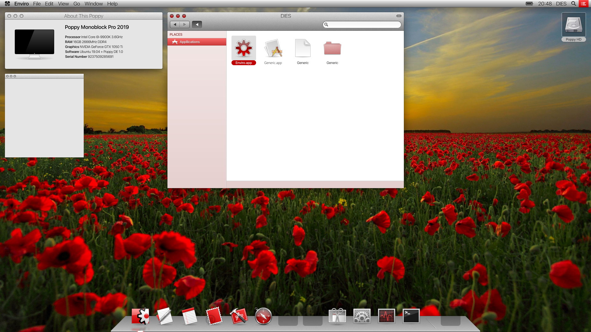
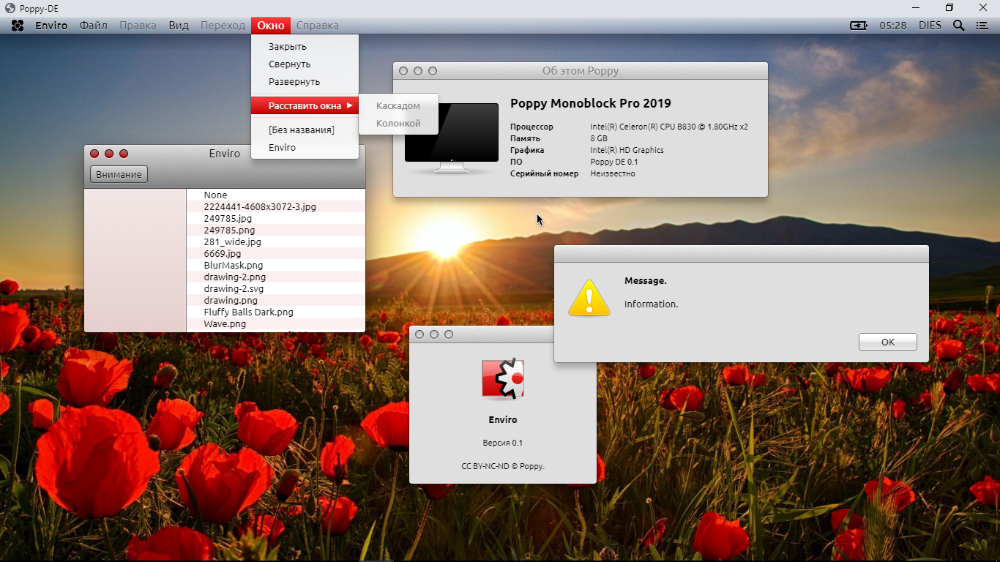

[RU](README.md) | **EN**

Poppy
--
Free OS X-like user experience implementation.

#### Concept

#### Screenshot

### Terminology

- Poppy &mdash; is a free project that develops several directions at once, which together provide a complete user experience similar to using Mac OS X (in particular, version 10.9 Mavericks), but without its worst sides, such as binding to specific hardware or paying for software. Unlike projects like pearOS, ravynOS and helloSystem - which focus mainly on superficial imitation of the macOS interface, or GnuStep - on the contrary, offering only the implementation of Cocoa-like libraries, Poppy - is being built as an ultimate solution, covering both the system level and the user environment, even at the cost of retreating from full compatibility with ready-made software.
- [Root Language](https://github.com/i-am-dies/Root-Language) &mdash; a general-purpose system-oriented interpreted programming language that does not included in the Poppy project directly because of its independence, but at the same time appeared for the sake of its implementation. Each line of PK and PSC is being written in Root.
- Poppy Kernel ("Opium") &mdash; a level 1 kernel that ensures the _unquestioning_ functionality of PSC on UNIX-like level 0 kernels. In addition to abstractions over the objects of the zero kernel, it also has its own logic (for example, a built-in Root IPC Server and KSP). In a normal configuration, it runs as PID 1 on top of Linux.
  - A level 0 kernel &mdash; is an OS kernel in the usual sense. It gets loaded into memory using hardware and a bootloader, communicates with system resources directly, implements objects (such as processes, timers, file systems, etc.) and the interface for them, runs PID 1.
  - A level 1 kernel &mdash; is an overlay kernel. Works as a proxy to the zero kernel with additional restrictions or extensions. Also provides system calls, manages processes, communications between them and other objects. Allows to unify the work of software with hardware without the need to rewrite drivers (kernel-space) and interfaces (user-space) - almost like cygwin does, but at a lower level. In theory, any kernel is suitable for it as a zero kernel, in practice - UNIX-like ones do the best.
  - Kernel Security Policy ("KSP") &mdash; a security system in the context of Opium, existing as the extension of POSIX rights (UID, GID, PID), allowing fine-tuning of access to system calls from processes, and explicitly contacting the user using trusted agents (CLI and GUI) in controversial cases. The policy allows configuring access based on both familiar POSIX and new logical restrictions. Has a cache of solutions and a white list, can be disabled at the discretion of the administrator. Works best when passwords are configured, but without them it does not become useless and still can restrict even UID 0. The closest analogs for comparison are UAC and SELinux.
- Poppy Software Collection ("PSC") &mdash; a collection of libraries, frameworks, console programs and graphical applications compatible with UX and some parts of the Darwin and OS X architecture. Most of the collection's software is a port and reverse engineering of GNU, GnuStep, Darwin and OS X. The core part of PSC depends more on the POSIX-compliance level of the underlying kernel than on Opium-specific system calls, so it can be used on some level 0 kernels without modification. The user-facing parts, namely `launchd`, `WindowServer`, `LoginWindow`, `Enviro`, `Dock`, `System Preferences` etc., may depend on special kernel mechanisms and Poppy OS file structure, and are therefore not guaranteed or expected to work outside of Opium.
- Poppy Operating System ("Poppy OS") &mdash; assembly of Linux + Root Server + Poppy Kernel + Poppy Software Collection. Everything that the Poppy project strives for converges at this end point. The Poppy operating system can be considered a clone of Mac OS X, if you do not go into details, and from a user point of view this will be justified, but the system goes through a completely different development path: many original solutions are reviewed before they end up in Poppy in one form or another (for example, the system does not limit anyone in the possibilities of developing and installing themes).

Note: The project is frozen until the release of [Root Language](https://github.com/i-am-dies/Root-Language). At the moment only the theoretical part given above is being developed.
